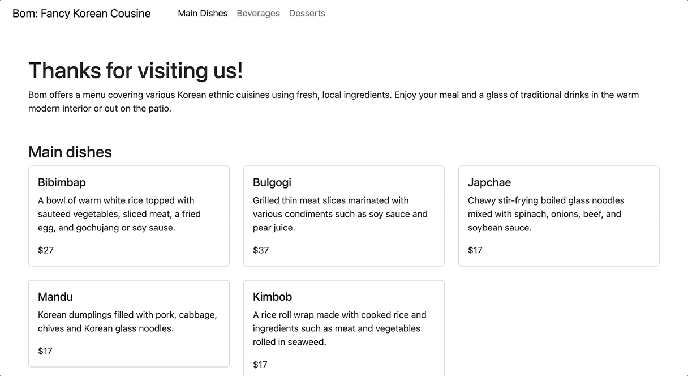

<h2 align="center">
  JS Express: Restaurant <br/>
</h2>

<h3 align="center">
Create five straightforward menus for main dishes, drinks, and desserts, each stored in a JSON data file. Then, set up a dynamic data retrieval system using Express.
</h3>

<div align="center">

</div>


---
## Tools 🛠️

### Environment


             

### Development


---
## Key takeaway of using express 📦

> -  Express indeed streamlines data connections.
> -  It saves time by providing efficient routing and middleware features.
> -  It allows engineers to quickly establish connections with databases and other data sources.


### Set up 
> -  Create a new directory for the project to use.
> -  Run "npm init" to generate the package.json file.
> -  Install Express using "npm install --save express". The "--save" flag updates the package.json file.
> -  Create a file named "app.js". This file serves as the entry point for the project.

```javascript

// ---------------[ Step 01: Set up ]
const express = require ("express");
const fs = require ("fs") // --> import JSON
const app = express();
const PORT = process.env.PORT || "3000";

// ---------------[ middleware ]
app.use(express.static("public"))


// ---------------[ Step 02: Read data ]
// Food
app.get("/food/data", (req, res) => {
    fs.readFile(__dirname+'/data/food.json', 'utf8', (err, data)=> {
        if (err) res.status(500).send("Server error! Check your server!")
        res.json(JSON.parse(data))
    })
});

// drinks
app.get("/drinks/data", (req, res) => {
    fs.readFile(__dirname+'/data/drinks.json', 'utf8', (err, data)=> {
        if (err) res.status(500).send("Server error! Check your server!")
        res.json(JSON.parse(data))
    })
});

// desserts
app.get("/desserts/data", (req, res) => {
    fs.readFile(__dirname+'/data/desserts.json', 'utf8', (err, data)=> {
        if (err) res.status(500).send("Server error! Check your server!")
        res.json(JSON.parse(data))
    })
});

app.get("/food", (req, res) => {
    res.sendFile(__dirname+'/public/food.html')
})

// ---------------[ Step 03: Set up Route ]
app.listen(PORT, () => {
    console.log(`Currently Listening on ${PORT}`);
  });
```

**Create folder and file directory**
> -  Project Root Folder: Contains all project-related files and folders.
> -  Data folder: Contains all source data files for the project.
> -  public Folder: Contains static assets like HTML, CSS, client-side JavaScript, images, etc.

### Set up main
> -  Make sure to have a space for data to be patched with unique id

```html
            <div class="container">
                <h3 class="mt-5">Main dishes</h3>
                <div class="row mt-2" id="food">
                </div>
            </div>
```

### Static Files and Views
> Express handles static files and views through middleware.
> - Create a "public" subdirectory within the project directory.
> - Add the static middleware.

```javascript
app.use(express.static("public"))

```
